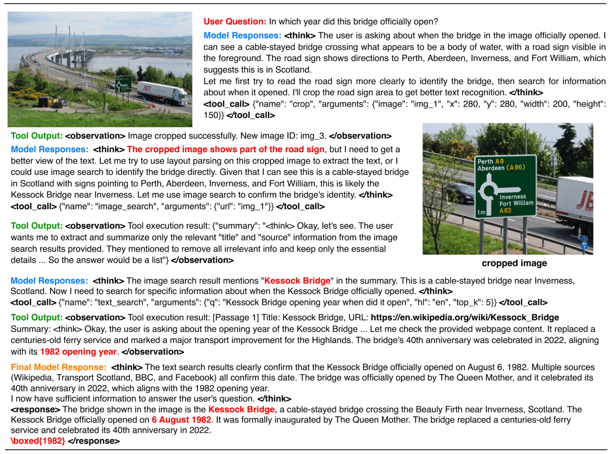

<div align="center">

  <h1 style="margin: 0; font-size: 1.8em;">
    OpenSearch-VL: An Open Recipe for Frontier Multimodal Search Agents
  </h1>

  <p><b>Cold-Start Agentic SFT &nbsp;·&nbsp; Multi-Turn Fatal-Aware GRPO &nbsp;·&nbsp; Visual Tool Use</b></p>

  [](https://github.com/shawn0728/OpenSearch-VL)
  [](https://huggingface.co/OpenSearch-VL)

  [](https://github.com/shawn0728/OpenSearch-VL)
  [](https://opensource.org/licenses/Apache-2.0)
  [](https://www.python.org/)
  

</div>

## 📑 Table of Contents

- [📖 Introduction](#-introduction)
- [🗺️ Overview](#%EF%B8%8F-overview)
- [🍭 Method Overview](#-method-overview)
- [📊 Main Results](#-main-results)
- [🔎 Case Study](#-case-study)
- [📁 Repository Layout](#-repository-layout)
- [🛠️ Prerequisites](#%EF%B8%8F-prerequisites)
- [🏋️ Agentic SFT · `code/SFT`](#%EF%B8%8F-agentic-sft--codesft)
- [🚀 Agentic RL · `code/RL`](#-agentic-rl--coderl)
- [📊 Inference & Evaluation · `code/infer`](#-inference--evaluation--codeinfer)
- [🚧 TODO](#-todo)
- [🙌 Acknowledgements](#-acknowledgements)

---

## 📖 Introduction

This work presents **OpenSearch-VL**, a fully open-source recipe for training frontier **multimodal deep-research agents** with **agentic reinforcement learning**. Unlike conventional VLMs that answer in a single forward pass, OpenSearch-VL iteratively *looks at images*, *crops / enhances* them, *issues web and image searches*, *visits pages*, and *writes a final answer grounded in the retrieved evidence*.

The strongest multimodal search agents today remain difficult to reproduce because their training data, trajectory-synthesis pipelines, and detailed training recipes are kept proprietary. OpenSearch-VL closes this gap by releasing **everything needed to reproduce the paper end-to-end**: data, code, and models.

Our recipe addresses three orthogonal challenges in one stack:

1. **Data** — A dedicated curation pipeline that builds high-quality, image-grounded multi-hop VQA from the Wikipedia hyperlink graph, using *fuzzy entity rewriting* and *source-anchored visual grounding* to suppress single-hop retrieval shortcuts. This yields **SearchVL-SFT-36k** for SFT and **SearchVL-RL-8k** for RL.
2. **Tools** — A unified visual + retrieval tool environment (`crop`, `layout_parsing`, `text_search`, `image_search`, `web_search`, `visit`, `perspective_correct`, `super_resolution`, `sharpen`, `python_interpreter`) shared by SFT data generation, RL rollout, and inference, so the agent can both *repair imperfect visual evidence* and *acquire external knowledge*.
3. **Algorithm** — A **multi-turn fatal-aware GRPO** that handles cascading tool failures by masking post-failure tokens and applying *one-sided advantage clamping* so that valid pre-failure reasoning is preserved rather than penalised.

Built on this recipe, **OpenSearch-VL delivers an average gain of more than 10 points across 7 benchmarks** (SimpleVQA, VDR, MMSearch, LiveVQA, BrowseComp-VL, FVQA, InfoSeek) and reaches results **comparable to proprietary commercial models** at the 30B / 32B scale.

---

## 🗺️ Overview

This repository provides everything needed to **reproduce, fine-tune, and evaluate** OpenSearch-VL:

| Component | Path | Description |
|-----------|------|-------------|
| **SFT Training** | [`SFT/`](SFT/) | Agentic cold-start with LLaMA-Factory + Ray + ZeRO-3 (full-parameter fine-tune of LLM + ViT + projector) |
| **RL Training** | [`RL/`](RL/) | Asynchronous agentic RLOO/GRPO on top of SFT, built on rLLM + verl + Megatron-LM + sglang |
| **Inference & Evaluation** | [`infer/`](infer/) | Unified `run_infer.py --model {8b,30b-a3b,32b,claude}` rollout + GPT-4o judge for BrowseComp-VL, HLE, VDR-Bench |
| **Models** | [OpenSearch-VL](https://huggingface.co/OpenSearch-VL) | OpenSearch-VL-{8B, 30B-A3B, 32B} checkpoints |
| **Datasets** | [OpenSearch-VL](https://huggingface.co/OpenSearch-VL) | SearchVL-SFT-36k (cold-start) and SearchVL-RL-8k (RL) |

### Workflow at a Glance

```
   ┌────────────────┐     ┌────────────────┐     ┌────────────────────┐
   │ Qwen3-VL base  │ ─── │ Agentic SFT    │ ─── │ Async Agentic RL   │ ───▶ OpenSearch-VL
   │ (HF weights)   │     │ (code/SFT)     │     │ (code/RL)          │
   └────────────────┘     └────────────────┘     └────────────────────┘
                                │                         │
                                ▼                         ▼
                        SearchVL-SFT-36k          SearchVL-RL-8k
                        7-domain tool-use         Vision-DeepResearch-QA
                        cold-start trajectories   (RLOO / GRPO + fatal-aware)
```

### Tool Environment

OpenSearch-VL is equipped with a heterogeneous tool set $\mathcal{T} = \mathcal{T}_v \cup \mathcal{T}_r$ shared by SFT, RL, and inference:

| Category | Tools | Purpose |
|---|---|---|
| **Retrieval** ($\mathcal{T}_r$) | `text_search`, `image_search`, `web_search`, `visit` | Acquire external textual / visual evidence and visit pages |
| **Image Enhancement** ($\mathcal{T}_v$) | `sharpen`, `super_resolution`, `perspective_correct` | Repair blurry, low-resolution, or skewed inputs before retrieval |
| **Attention & Parsing** ($\mathcal{T}_v$) | `crop`, `layout_parsing` (OCR) | Localize regions of interest and decode fine-grained content |
| **Computation** | `python_interpreter` | Numerical / programmatic computation on retrieved evidence |

### Quick Links

- **Get started** → [Prerequisites](#-prerequisites)
- **Train your own SFT model** → [Agentic SFT](#%EF%B8%8F-agentic-sft--codesft)
- **Run agentic RL** → [Agentic RL](#-agentic-rl--coderl)
- **Inference & benchmark** → [Inference & Evaluation](#-inference--evaluation--codeinfer)

---

## 🍭 Method Overview

**Data Curation Pipeline.**
Starting from the English Wikipedia hyperlink graph, we sample multi-hop entity paths and convert them into multi-hop VQA instances by (a) extracting canonical question–answer pairs along the path, (b) rewriting each intermediate entity into a fuzzy descriptor while certifying answer invariance and uniqueness, and (c) anchoring the question on a representative image of the **source** node — *not* the answer node — so that single-hop image lookup shortcuts are eliminated. The pipeline finishes with staged tool-demanding filtering and an enhancement subset (random degradations paired with the corresponding restoration tools) before synthesizing multi-turn expert trajectories with answer- and process-level rejection sampling.


**RL Training Pipeline.**
Starting from the SFT-initialized checkpoint, we sample a group of multi-turn trajectories against the real environment $\mathcal{E}$. Each trajectory is scored by a composite reward combining final-task accuracy ($r_{\text{acc}}$), process-level search-query quality ($r_{\text{query}}$), and a multiplicative format gate ($r_{\text{fmt}}$). To preserve valid reasoning when a trajectory eventually triggers cascading tool failures, we apply **fatal-aware token masking** to truncate the sequence at the fatal step $f_i$ and **one-sided advantage clamping** ($\hat{A}_i = \max(\widetilde{r}_i, 0)$ for fatal trajectories) during policy optimization, preventing the suppression of viable early reasoning.


---

## 📊 Main Results

OpenSearch-VL is built on three Qwen3-VL variants and evaluated on **7 multimodal knowledge-intensive QA / web-search benchmarks** under the same Pass@1 + GPT-4o judge protocol as VDR-Bench.


**Highlights.**
*OpenSearch-VL-8B* is the strongest open 8B agent (**+3.9** Avg over SenseNova-MARS-8B). *OpenSearch-VL-30B-A3B* improves the Qwen3-VL agentic baseline by **+13.8** Avg, with large gains on **VDR (+13.3)**, **MMSearch (+24.5)**, **FVQA (+10.2)**, and **InfoSeek (+16.2)**. *OpenSearch-VL-32B* surpasses Gemini-2.5-Pro and Claude-4-Sonnet direct-reasoning baselines on most benchmarks.

**Fatal-aware GRPO ablation.**
Vanilla search-augmented GRPO improves SFT 64.6 → 67.6 Avg; the hard-masking baseline of Vision-DeepResearch saturates at 67.7; **fatal masking** alone reaches 69.1; our **full method with one-sided advantage clamping reaches 71.8** — a +4.2 gain over vanilla GRPO and the best score on every benchmark.

<div align="center">
  
</div>

Fatal-aware GRPO sustains a **higher number of tool-use turns *and* a higher batch accuracy** than vanilla GRPO and the Hard-Mask baseline — encouraging productive exploration rather than prematurely suppressing difficult rollouts.

---

## 🔎 Case Study

The example below illustrates a representative OpenSearch-VL trajectory on a knowledge-intensive visual question: **“In what year did this bridge open?”** The answer cannot be read directly from the image or reliably produced by parametric knowledge alone. Instead, the agent progressively grounds the query through tool use.

<div align="center">
  
</div>

**Tool-use flow.**
1. **Visual inspection** — The agent identifies the roadside sign as the most useful visual clue.
2. **Crop** — It zooms into the sign to obtain a cleaner local view.
3. **Image search** — The cropped region helps identify the structure as the **Kessock Bridge**.
4. **Text search / verification** — A targeted search verifies the official opening year as **1982**.

This case highlights the core behavior encouraged by OpenSearch-VL: the agent does not guess from a single model pass, but chains visual perception, image retrieval, and textual evidence acquisition until the answer is grounded.

---

## 📁 Repository Layout

```
code/
├── SFT/                           # agentic supervised fine-tuning (LLaMA-Factory fork)
│   ├── examples/agentic_full/     # training YAMLs for Qwen2.5-VL / Qwen3-VL / Qwen3.5-VL
│   ├── examples/deepspeed/        # ZeRO-2 / ZeRO-3 configs
│   ├── data/dataset_info.json     # 7 agentic-SFT datasets (relative paths)
│   ├── src/llamafactory/          # LLaMA-Factory source (trainer, data loader, CLI)
│   └── README.md                  # SFT-specific instructions
│
├── RL/                            # reinforcement learning on the SFT checkpoint
│   ├── rllm/                      # rLLM + verl + vision_deepresearch_async_workflow/
│   ├── Megatron-LM/               # Megatron backend
│   ├── mbridge/                   # HF ↔ Megatron parallelism bridge
│   └── README.md                  # RL-specific instructions
│
├── infer/                         # inference + benchmark evaluation
│   ├── run_infer.py               # unified entrypoint (--model 8b|32b|30b-a3b|claude)
│   ├── run_infer.sh               # env-driven launcher around run_infer.py
│   ├── eval_with_gpt4o.py         # GPT-4o judge for BrowseComp-VL / HLE / VDR-Bench
│   ├── run_eval.sh                # env-driven judge driver across all benchmarks
│   ├── .env.example               # template for inference / judge / search keys
│   └── opensearch_infer/          # modular package: config, prompts, auth, tools,
│                                  # search, runners (Claude + Qwen3-VL dense / MoE),
│                                  # message converters, multi-turn pipeline
│
└── README.md                      # (this file)
```

---

## 🛠️ Prerequisites

| Component   | Minimum                                                       |
| ----------- | ------------------------------------------------------------- |
| Python      | 3.10+                                                         |
| CUDA        | 12.1+ (12.4 recommended)                                      |
| PyTorch     | ≥ 2.4 with CUDA support                                       |
| GPU         | ≥ 1× H100 / H800 / A100-80GB for 8B (multi-node for 30B / 32B) |
| NCCL / RDMA | InfiniBand / RoCE recommended for multi-node; see `RL/rllm/.env.example` |

The three components share most of their Python dependencies (PyTorch, `transformers`, `transformer_engine`, `flash-attn`, `deepspeed`, `ray`, `qwen-vl-utils`, `sglang`) — we recommend installing each sub-project into its **own virtual environment**.

### External API keys

All keys are optional; components gracefully no-op if unset.

| Variable | Used by | Purpose |
| --- | --- | --- |
| `API_GATEWAY_HOST` / `API_GATEWAY_USER` / `API_GATEWAY_KEY` | RL | Optional HMAC-secured gateway that proxies Serper + Jina behind one credential (set on RL workers). |
| `API_HOST` / `API_USER` / `API_KEY` | infer | Same gateway, named to match the inference package's env vars. |
| `SERPER_API_KEY` | RL, infer | [Serper.dev](https://serper.dev) text & image search (used when no gateway is configured). |
| `JINA_API_KEY` | RL, infer | [Jina AI](https://jina.ai) reader (page visit / content extraction). |
| `QWEN_API_BASE` / `QWEN_MODEL_NAME` | infer | OpenAI-compatible chat-completions server used for search summarization (defaults to a local Qwen3-32B). |
| `LAYOUT_PARSING_API_URL` / `LAYOUT_PARSING_TOKEN` | RL, infer | PP-StructureV3-compatible OCR / layout endpoint. |
| `CLAUDE_API_HOST` / `CLAUDE_API_USER` / `CLAUDE_API_KEY` | infer | Optional HMAC-secured gateway for the Claude Opus 4.5 backend. |
| `JUDGE_API_BASE_URL` / `JUDGE_APP_ID` / `JUDGE_APP_KEY` / `JUDGE_MODEL_MARKER` | infer | OpenAI-compatible GPT-4o judge used by `eval_with_gpt4o.py`. |
| `QWEN3VL_8B_PATH` / `QWEN3VL_32B_PATH` / `QWEN3VL_30B_A3B_PATH` | infer | Local checkpoints for the three Qwen3-VL variants (overrideable via `--checkpoint`). |
| `FVQA_IMAGE_DIR` | infer | Optional fallback directory of `<case_id>.<ext>` images used when a benchmark URL is unreachable. |
| `WANDB_API_KEY` | SFT, RL | W&B logging. |

Two templates are provided: [`RL/rllm/.env.example`](RL/rllm/.env.example) for the RL workers, and [`infer/.env.example`](infer/.env.example) for inference + judge. Copy whichever applies and source it before launching.

---

## 🏋️ Agentic SFT · `code/SFT`

Cold-starts the base VLM on **7 tool-use datasets** (FVQA, Palace, WebQA, LiveVQA, WikiArt, Wiki-zh, Wiki-en — together forming **SearchVL-SFT-36k**, with an average of 6.3 tool-invocation turns per trajectory). We perform a **full-parameter fine-tune of the LLM + vision tower + projector** with DeepSpeed ZeRO-3, distributed via Ray.

### Install

```bash
cd code/SFT
pip install -e ".[torch,metrics,deepspeed,ray]"
pip install qwen-vl-utils pillow av decord torchvision flash-attn
```

### Data layout

Download the **SearchVL-SFT-36k** bundle from the [HuggingFace collection](https://huggingface.co/OpenSearch-VL) and place the 7 sub-sets under `code/SFT/data/` so that the **relative** `file_name` values in [`data/dataset_info.json`](SFT/data/dataset_info.json) resolve:

```
SFT/data/
├── dataset_info.json
├── new_fvqa/fvqa_llama_factory_clean.json
├── palace/palace_llama_factory_filtered.json
├── WebQA/webqa_llama_factory_filtered.json
├── new_livevqa/livevqa_llama_factory_filtered.json
├── wikiart/wikiart_llama_factory_filtered.json
├── wiki_en/wiki_en_llama_factory_filtered.json
└── wiki_zh/wiki_zh_llama_factory_filtered.json
```

Each JSON is in **ShareGPT format** with `conversations`, `images`, `system`, and `tools` columns.

### Launch

```bash
cd code/SFT

# Multi-node Ray (16 nodes × 8 GPU by default):
USE_RAY=1 llamafactory-cli train \
    examples/agentic_full/qwen3_vl_full_sft_8b_ray.yaml

# Single-node smoke test:
FORCE_TORCHRUN=1 NNODES=1 NPROC_PER_NODE=8 llamafactory-cli train \
    examples/agentic_full/qwen3_vl_full_sft_8b_ray.yaml
```

### Available training configs

Edit `ray_num_workers`, `placement_strategy`, and NCCL / IB vars to match your cluster.

| YAML | Model | # workers |
| ---- | ----- | --------- |
| `qwen3_vl_full_sft_8b_ray.yaml`      | Qwen3-VL-8B-Instruct      | 256 |
| `qwen3_vl_full_sft_30_3b_ray.yaml`   | Qwen3-VL-30B-A3B-Instruct | 256 |
| `qwen3_vl_full_sft_32b_ray.yaml`     | Qwen3-VL-32B-Instruct     | 256 |
| `qwen3_5vl_full_sft_27b_ray.yaml`    | Qwen3.5-VL-27B-Instruct   | 256 |
| `qwen3_5vl_full_sft_35b_3b_ray.yaml` | Qwen3.5-VL-35B-A3B        | 256 |
| `qwen2_5_vl_full_sft_7b_ray.yaml`    | Qwen2.5-VL-7B-Instruct    | 256 |
| `qwen2_5_vl_full_sft_32b_ray.yaml`   | Qwen2.5-VL-32B-Instruct   | 256 |
| `qwen2_5_vl_full_sft_72b_ray.yaml`   | Qwen2.5-VL-72B-Instruct   | 256 |

### Shared hyper-parameters

| Hyperparameter | Value |
| --- | --- |
| Cutoff length | `32000` |
| Precision | `bf16` |
| Learning rate | `2e-5` (cosine, `warmup_ratio=0.1`) |
| Epochs | `8` |
| Per-device batch | `1` (with `gradient_checkpointing: true`) |
| DeepSpeed | ZeRO-3 (`examples/deepspeed/ds_z3_config.json`) |
| Frozen modules | none (`freeze_vision_tower: false`, `freeze_multi_modal_projector: false`) |

Checkpoints land in `saves/<model>/full/sft_data_v1/` (override via `output_dir` / `ray_storage_path` in the YAML).

> Full details, dataset format, and cluster notes: [`code/SFT/README.md`](SFT/README.md).

---

## 🚀 Agentic RL · `code/RL`

**Asynchronous agentic RLOO / GRPO / PPO** on top of the SFT checkpoint, using [rLLM](https://github.com/rllm-org/rllm)'s `AgentWorkflowEngine`, [verl](https://github.com/volcengine/verl) as the policy-optimization backend, and [Megatron-LM](https://github.com/NVIDIA/Megatron-LM) + [mbridge](https://github.com/ISEEKYAN/mbridge) for large-scale model parallelism. Trajectories are rolled out by sglang; Megatron handles actor / ref updates.

### Install

```bash
cd code/RL/rllm    && pip install -e .
cd ../Megatron-LM  && pip install -e .
cd ../mbridge      && pip install -e .
pip install "sglang[all]" transformer_engine flash-attn \
            ray==2.34.* hydra-core omegaconf wandb \
            pillow requests python-dotenv
```

Copy the env template:

```bash
cp RL/rllm/.env.example RL/rllm/.env   # edit keys as needed
```

### Data preparation

The workflow expects `rllm.data.DatasetRegistry` to hold a dataset named `Vision-DeepResearch-QA` (i.e. **SearchVL-RL-8k**). Two helpers in `RL/rllm/vision_deepresearch_async_workflow/data_prepare/` handle the conversion:

```bash
cd RL/rllm/vision_deepresearch_async_workflow/data_prepare

# 1) Extract embedded image bytes → PNG + JSONL
DATA_ROOT=./data/Vision-DeepResearch-RL-Data \
    bash convert_parquet2jsonl.sh

# 2) Register it with rLLM as "Vision-DeepResearch-QA" (90 / 10 split)
JSONL_PATH=./data/Vision-DeepResearch-RL-Data/vision-deepresearch_RL_Demo_1k.jsonl \
    bash register_rl_dataset.sh
```

### Launch

All run scripts `cd` into `rllm/`, auto-source `.env`, and call `python -m vision_deepresearch_async_workflow.train_deepresearch_workflow_megatron` with the right Hydra overrides.

```bash
# Primary configuration in the paper: 8B dense, 8 nodes × 8 GPU
bash RL/rllm/vision_deepresearch_async_workflow/run/qwen3-vl-8b-multi-node.sh

# Other presets:
bash RL/rllm/vision_deepresearch_async_workflow/run/qwen3-vl-8b-single-node.sh    # 1-node smoke test
bash RL/rllm/vision_deepresearch_async_workflow/run/qwen3-vl-30b-3b-multi-node.sh # 30B-A3B MoE
bash RL/rllm/vision_deepresearch_async_workflow/run/qwen3-vl-32b-multi-node.sh    # 32B dense
```

### Key hyper-parameters (8B multi-node)

| Field | Value |
| --- | --- |
| Advantage estimator | `rloo` (set `grpo` / `reinforce_plus_plus` to swap) |
| KL coefficient | `0.001` |
| Clip ratio (high) | `0.28` |
| Train prompt batch | `256` (group size `n_resp_per_prompt=8`, mini-batch `64`) |
| Max prompt / response length | `4096` / `70000` |
| Megatron parallelism | `TP=4 / PP=2 / CP=8` (dense) |
| sglang rollout | `TP=4`, `gpu_memory_utilization=0.85` |
| Reward composition | $r = r_{\text{fmt}} \cdot [\,0.8\, r_{\text{acc}} + 0.2\, r_{\text{query}}\,]$ |
| Fatal threshold $K$ | `3` consecutive tool-execution errors |

Checkpoints go to `checkpoints/${project_name}/${exp_name}/`; trajectories can be dumped to `$TRAJ_DUMP_DIR` (default `./trajectory_dumps/<exp>/`).

### Reproducing the paper

| Variant | Script | Cluster |
| --- | --- | --- |
| OpenSearch-VL-8B          | `qwen3-vl-8b-multi-node.sh`       | 8 × 8 H100 / H800 |
| OpenSearch-VL-30B-A3B     | `qwen3-vl-30b-3b-multi-node.sh`   | 8 × 8 H100 / H800 |
| OpenSearch-VL-32B         | `qwen3-vl-32b-multi-node.sh`      | 16 × 8 H100 / H800 |

> Full details, environment variables, and cluster notes: [`code/RL/README.md`](RL/README.md).

---

## 📊 Inference & Evaluation · `code/infer`

Modular Python package that drives the trained model as a **tool-using Visual Investigation Agent**, plus a **GPT-4o judge** for standardized benchmark scoring. The same agent loop, tool environment and search/visual utilities are shared across all three Qwen3-VL backends and the optional Claude Opus 4.5 backend; the variant is selected with a single `--model` flag.

### Package layout

```
infer/
├── run_infer.py                  # unified entrypoint (--model 8b|32b|30b-a3b|claude)
├── run_infer.sh                  # env-driven wrapper around run_infer.py
├── run_eval.sh                   # env-driven judge driver across all benchmarks
├── eval_with_gpt4o.py            # GPT-4o judge for BrowseComp-VL / HLE / VDR-Bench
├── .env.example                  # full env-variable template
└── opensearch_infer/
    ├── config.py                 # env-driven settings + ModelSpec registry
    ├── prompts.py                # Visual Investigation Agent system prompt
    ├── auth.py                   # HMAC helper + Claude gateway client
    ├── cos_upload.py             # optional COS uploader bootstrap
    ├── image_io.py               # image download / decode / cache utilities
    ├── image_engines.py          # PIL + OpenCV crop / OCR / enhance pipelines
    ├── search.py                 # text_search / image_search / layout_parsing
    ├── tools.py                  # JSON tool schema + parsing + dispatcher
    ├── messages.py               # Gemini ↔ Claude / Qwen3-VL converters
    ├── runners.py                # ClaudeRunner + Qwen3VLRunner (dense + MoE)
    └── pipeline.py               # per-case multi-turn agent loop
```

### Rollout

One entrypoint, four backends. Each call accepts a parquet of questions + images and writes one trajectory JSON per sample:

| `--model`   | Backend                                              |
| ----------- | ---------------------------------------------------- |
| `8b`        | OpenSearch-VL-8B (Qwen3-VL-8B base, dense)           |
| `32b`       | OpenSearch-VL-32B (Qwen3-VL-32B base, dense)         |
| `30b-a3b`   | OpenSearch-VL-30B-A3B (Qwen3-VL-30B-A3B base, MoE)   |
| `claude`    | Claude Opus 4.5 via HMAC gateway (no GPU required)   |

Multi-GPU model parallelism is enabled automatically when `--gpus 0,1,...` lists more than one device (`device_map="auto"`); single-GPU placement uses `device_map={"": "cuda:N"}`. The MoE scatter dtype patch for 30B-A3B is applied automatically.

```bash
# Source the env template first; only the entries you need have to be filled in.
cp infer/.env.example ~/.opensearch-vl.env
source ~/.opensearch-vl.env

# Dense Qwen3-VL-8B on a single GPU
python infer/run_infer.py --model 8b --gpus 0 \
    --data-path  /path/to/benchmark.parquet \
    --output-dir ./outputs/opensearch_vl_8b \
    --start 0 --end 1000

# MoE Qwen3-VL-30B-A3B with 4-way model parallel (auto-applies the scatter dtype patch)
python infer/run_infer.py --model 30b-a3b --gpus 0,1,2,3 \
    --checkpoint /path/to/OpenSearch-VL-30B-A3B \
    --data-path  /path/to/benchmark.parquet \
    --output-dir ./outputs/opensearch_vl_30b_a3b

# Claude Opus 4.5 (CLAUDE_API_HOST / _USER / _KEY required)
python infer/run_infer.py --model claude \
    --data-path  /path/to/benchmark.parquet \
    --output-dir ./outputs/claude_opus
```

The shell wrapper `infer/run_infer.sh` reads the same parameters from environment variables (`MODEL`, `GPUS`, `DATA_PATH`, `OUTPUT_DIR`, `LIMIT`, `CATEGORY`, ...) for one-line invocations.

### Benchmark evaluation

[`eval_with_gpt4o.py`](infer/eval_with_gpt4o.py) consumes the trajectory directory produced above and calls a GPT-4o-class judge to compute per-sample correctness using the **VDR-Bench evaluation prompt**:

```bash
python infer/eval_with_gpt4o.py \
    --traj_dir    ./outputs/opensearch_vl_8b/bc_vl_level1 \
    --benchmark   bc_vl            # one of: hle | bc_vl | vdr
    --max_workers 20
```

`--answer_file` is required for VDR-Bench (pass the `.parquet` with `id` / `answer` columns).

[`run_eval.sh`](infer/run_eval.sh) is a thin driver that chains the five reported evaluations (BrowseComp-VL L1, BrowseComp-VL L2, HLE, VDR-Bench testmini × 2 models). Configure trajectory directories via env variables (`TRAJ_BC_VL_LEVEL1`, `TRAJ_BC_VL_LEVEL2`, `TRAJ_HLE`, `TRAJ_VDR_PRIMARY`, `TRAJ_VDR_SECONDARY`, `VDR_ANSWER_PARQUET`) and run:

```bash
bash infer/run_eval.sh --workers 20
```

> Full inference details: [`code/infer/README.md`](infer/README.md).

---

## 🚧 TODO

- [ ] Release **OpenSearch-VL-{8B, 30B-A3B, 32B}** checkpoints on the [HuggingFace collection](https://huggingface.co/OpenSearch-VL).
- [ ] Release **SearchVL-SFT-36k** and **SearchVL-RL-8k** datasets (full bundle + image assets).
- [ ] Release the **data curation pipeline** (Wikipedia path sampling, fuzzy entity rewriting, source-anchor visual grounding) as a standalone toolkit.
- [ ] Public **demo** for interactive multi-turn deep-research rollouts.

All artifacts have entered the final approval stage. Stay tuned — once the approval process is complete, we will release them **ASAP**.

---

## 🙌 Acknowledgements

This repository bundles and builds on several outstanding open-source projects; each sub-directory retains its upstream `LICENSE`:

- [**LLaMA-Factory**](https://github.com/hiyouga/LLaMA-Factory) — SFT trainer and CLI (`code/SFT/`).
- [**rLLM**](https://github.com/rllm-org/rllm) and [**verl**](https://github.com/volcengine/verl) — agentic RL framework (`code/RL/rllm/`).
- [**Megatron-LM**](https://github.com/NVIDIA/Megatron-LM) and [**mbridge**](https://github.com/ISEEKYAN/mbridge) — model-parallel backend (`code/RL/Megatron-LM/`, `code/RL/mbridge/`).
- [**sglang**](https://github.com/sgl-project/sglang) — async rollout engine.
- [**Qwen-VL**](https://github.com/QwenLM/Qwen3-VL) — base VLM checkpoints.
- We also thank the authors of [Search-R1](https://github.com/PeterGriffinJin/Search-R1) and [Vision-DeepResearch](https://github.com/Alibaba-NLP/Vision-DeepResearch) whose ideas inspired our multi-turn search-augmented RL formulation.

Project-specific additions are released under the root [`LICENSE`](LICENSE) (Apache 2.0).

---

